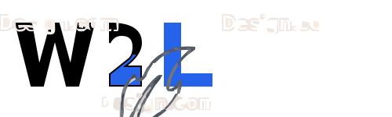

<!-- Improved compatibility of back to top link: See: https://github.com/othneildrew/Best-README-Template/pull/73 -->
<a id="readme-top"></a>

<!-- PROJECT LOGO -->
<br />
<div align="center">
  <a href="https://github.com/Curiolytics/Write2Learn">
    
  </a>

  <h3 align="center">Write2Learn (W2L)</h3>

  <p align="center">
    Write your Thoughts, Learn your Words.
    <br />
    <a href="https://github.com/Curiolytics/Write2Learn"><strong>Explore the docs »</strong></a>
    <br />
    <br />
    <a href="https://github.com/Curiolytics/Write2Learn/issues">Report Bug</a>
    &middot;
    <a href="https://github.com/Curiolytics/Write2Learn/issues">Request Feature</a>
  </p>
</div>


<!-- TABLE OF CONTENTS -->
<details>
  <summary>Table of Contents</summary>
  <ol>
    <li>
      <a href="#about-the-project">About The Project</a>
      <ul>
        <li><a href="#built-with">Built With</a></li>
      </ul>
    </li>
    <li>
      <a href="#getting-started">Getting Started</a>
      <ul>
        <li><a href="#prerequisites">Prerequisites</a></li>
        <li><a href="#installation">Installation</a></li>
      </ul>
    </li>
    <li><a href="#usage">Usage</a></li>
    <li><a href="#roadmap">Roadmap</a></li>
    <li><a href="#contributing">Contributing</a></li>
    <li><a href="#license">License</a></li>
    <li><a href="#contact">Contact</a></li>
  </ol>
</details>


<!-- ABOUT THE PROJECT -->
## About The Project

**Write2Learn** is an AI-powered English learning platform designed to solve the "Passive Learning" trap. Many learners consume content (Input) but struggle to produce language (Output). W2L bridges this gap by providing a structured, interactive environment for **Journaling**, **Vocabulary Building**, and **Roleplay**.

I believe that language learning should be personalized, immediate, and context-aware.

### Why Write2Learn?

*   **😓 Problem:** Forgetting vocabulary constantly?
    *   **✅ Solution:** **Spaced Repetition System (SRS)** ensures you review words at the perfect moment to maximize retention.
*   **📝 Problem:** Writer's block or fear of making mistakes?
    *   **✅ Solution:** **AI-Powered Journaling** with topic templates and instant feedback on grammar, vocabulary, and natural phrasing.
*   **🗣️ Problem:** No partner to practice speaking with?
    *   **✅ Solution:** **24/7 AI Roleplay** scenarios (Travel, Interview, Shopping) to build confidence and reflex.
*   **🎯 Problem:** Unsure of your progress?
    *   **✅ Solution:** **Smart Dashboard** tracks your growth and suggests personalized practice sessions.

<p align="right">(<a href="#readme-top">back to top</a>)</p>


### Built With

This project is built with a modern, performance-focused tech stack:

*   [![Next][Next.js]][Next-url] **Next.js 15 (App Router)** - The React Framework for the Web.
*   [![React][React.js]][React-url] **React 19** - For building user interfaces.
*   [![TailwindCSS][TailwindCSS]][TailwindCSS-url] **Tailwind CSS v4** - For rapid, utility-first styling.
*   [![Supabase][Supabase]][Supabase-url] **Supabase** - For Authentication & Database (PostgreSQL).
*   [![TypeScript][TypeScript]][TypeScript-url] **TypeScript** - For type-safe code.
*   **Zustand** - For lightweight state management.
*   **Tiptap** - For a rich text editing experience.
*   **ts-fsrs** - For the Free Spaced Repetition Scheduler algorithm.

<p align="right">(<a href="#readme-top">back to top</a>)</p>


<!-- GETTING STARTED -->
## Getting Started

To get a local copy up and running, follow these simple steps.

### Prerequisites

*   Node.js (v18 or higher recommended)
*   npm
    ```sh
    npm install npm@latest -g
    ```

### Installation

1.  **Clone the repo**
    ```sh
    git clone https://github.com/Curiolytics/Write2Learn.git
    ```
2.  **Install NPM packages**
    ```sh
    npm install
    ```
3.  **Set up Environment Variables**
    Create a `.env.local` file in the root directory and add your Supabase credentials:
    ```env
    NEXT_PUBLIC_SUPABASE_URL=your_supabase_url
    NEXT_PUBLIC_SUPABASE_ANON_KEY=your_supabase_anon_key
    ```
4.  **Run the development server**
    ```sh
    npm run dev
    ```

<p align="right">(<a href="#readme-top">back to top</a>)</p>


<!-- USAGE EXAMPLES -->
## Usage

1.  **Home**: Central hub for quick access to Journaling templates and Practice sessions (Roleplay & Flashcards).
2.  **Roleplay**: Practice real-world conversations (e.g., "Ordering Coffee") with AI partners. Review session history to track improvement.
3.  **Journal**: Write daily entries using templates or free-form. Get instant AI feedback on grammar and vocabulary.
4.  **Vocab**: Review flashcards using Spaced Repetition (FSRS) to maximize retention.
5.  **Report**: Analyze learning trends, view grammar error patterns, and monitor weekly activity.

<p align="right">(<a href="#readme-top">back to top</a>)</p>


<!-- ROADMAP -->
## Roadmap

- [x] **Core Features**
    - [x] Authentication (Supabase)
    - [x] Journaling with Rich Text Editor
    - [x] AI Feedback Integration
    - [x] Vocabulary Management
- [x] **Advanced Learning**
    - [x] Spaced Repetition System (FSRS)
    - [x] Roleplay Scenarios
- [ ] **Future Enhancements**
    - [ ] Mobile Application (React Native)
    - [ ] Multi-language Support (Spanish, Chinese, etc.)
    - [ ] Social Features (Leaderboards, Challenges)

See the [open issues](https://github.com/Curiolytics/Write2Learn/issues) for a full list of proposed features (and known issues).

<p align="right">(<a href="#readme-top">back to top</a>)</p>


<!-- CONTRIBUTING -->
## Contributing

Contributions are what make the open source community such an amazing place to learn, inspire, and create. Any contributions you make are **greatly appreciated**.

If you have a suggestion that would make this better, please fork the repo and create a pull request. You can also simply open an issue with the tag "enhancement".
Don't forget to give the project a star! Thanks again!

1.  Fork the Project
2.  Create your Feature Branch (`git checkout -b feature/AmazingFeature`)
3.  Commit your Changes (`git commit -m 'Add some AmazingFeature'`)
4.  Push to the Branch (`git push origin feature/AmazingFeature`)
5.  Open a Pull Request

<p align="right">(<a href="#readme-top">back to top</a>)</p>


<!-- LICENSE -->
## License

Distributed under the MIT License. See `LICENSE.txt` for more information.

<p align="right">(<a href="#readme-top">back to top</a>)</p>


<!-- CONTACT -->
## Contact

Nguyễn Ly - lynguyen18.work@gmail.com

Project Link: [https://github.com/Curiolytics/Write2Learn](https://github.com/Curiolytics/Write2Learn)

<p align="right">(<a href="#readme-top">back to top</a>)</p>


<!-- MARKDOWN LINKS & IMAGES -->
<!-- https://www.markdownguide.org/basic-syntax/#reference-style-links -->
[Next.js]: https://img.shields.io/badge/next.js-000000?style=for-the-badge&logo=nextdotjs&logoColor=white
[Next-url]: https://nextjs.org/
[React.js]: https://img.shields.io/badge/React-20232A?style=for-the-badge&logo=react&logoColor=61DAFB
[React-url]: https://reactjs.org/
[TailwindCSS]: https://img.shields.io/badge/Tailwind_CSS-38B2AC?style=for-the-badge&logo=tailwind-css&logoColor=white
[TailwindCSS-url]: https://tailwindcss.com/
[Supabase]: https://img.shields.io/badge/Supabase-3ECF8E?style=for-the-badge&logo=supabase&logoColor=white
[Supabase-url]: https://supabase.com/
[TypeScript]: https://img.shields.io/badge/TypeScript-007ACC?style=for-the-badge&logo=typescript&logoColor=white
[TypeScript-url]: https://www.typescriptlang.org/