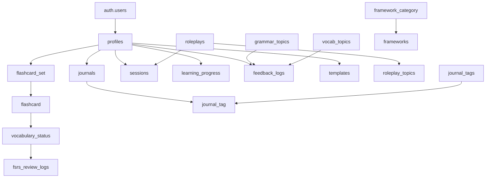

# 📊 Comprehensive Database Structure Analysis

> **Last Updated**: November 16, 2025  
> **Data Source**: Supabase Live Database Analysis via MCP  
> **Project**: CurioLytics W2L v1.0  

---

## 📈 Database Statistics

- **Project**: eqhldzwiymtcyxyxezos (S2L - Active)
- **Total Tables**: 18 public tables
- **Total Records**: 620+ records across public tables
- **Postgres Version**: 17.6.1.005
- **Region**: us-east-2

---

## 🗄️ Core Tables Overview

### 📋 Main Entity Tables

| Table | Records | Primary Function | RLS Enabled |
|-------|---------|------------------|-------------|
| **profiles** | 1 | User profiles and settings | ✅ Yes |
| **journals** | 55 | Journal entries | ✅ Yes |
| **vocabulary_set** | 3 | Vocabulary collections | ✅ Yes |
| **vocabulary** | 108 | Individual vocabulary words | ❌ No |
| **sessions** | 31 | Roleplay conversation sessions | ❌ No |
| **roleplays** | 3 | Roleplay scenarios | ❌ No |

### 📈 Supporting Tables

| Table | Records | Purpose |
|-------|---------|---------||
| **vocabulary_status** | 108 | FSRS learning algorithm data |
| **fsrs_review_logs** | 186 | Review history tracking |
| **feedback_logs** | 6 | Learning feedback analytics |
| **grammar_topics** | 25 | Grammar learning topics |
| **vocab_topics** | 31 | Vocabulary learning topics |

---

## 🔗 Complete Table Specifications

### 👤 **profiles** (Core User Data)
```sql
Table: profiles (RLS: ✅ ON) - 1 records
```
| Column | Type | Default | Constraints | Description |
|--------|------|---------|-------------|-------------|
| **id** | uuid | - | PK, FK → auth.users.id | User identifier |
| name | text | null | nullable | User's display name |
| english_level | text | null | nullable | Learning level |
| goals | text[] | null | nullable | Learning objectives |
| writing_types | text[] | null | nullable | Preferred writing styles |
| onboarding_completed | boolean | false | nullable | Setup completion flag |
| updated_at | timestamptz | null | nullable | Last profile update |
| pinned_template_ids | uuid[] | {} | nullable | Favorited templates |

### 📝 **journals** (Journal Entries)
```sql
Table: journals (RLS: ✅ ON) - 55 records
```
| Column | Type | Default | Constraints | Description |
|--------|------|---------|-------------|-------------|
| **id** | uuid | gen_random_uuid() | PK | Entry identifier |
| user_id | uuid | null | FK → profiles.id | Author reference |
| content | text | - | required | Journal content |
| journal_date | date | CURRENT_DATE | nullable | Entry date |
| title | text | null | nullable | Entry title |
| enhanced_version | text | null | nullable | AI-improved version |

### 🃏 **vocabulary_set** (Vocabulary Collections)
```sql
Table: vocabulary_set (RLS: ✅ ON) - 3 records
```
| Column | Type | Default | Constraints | Description |
|--------|------|---------|-------------|-------------|
| **id** | uuid | gen_random_uuid() | PK | Set identifier |
| title | text | - | required | Collection name |
| created_at | timestamptz | now() | nullable | Creation timestamp |
| profile_id | uuid | null | FK → profiles.id | Owner reference |
| description | text | null | nullable | Set description |
| is_default | boolean | false | nullable | System-provided set |
| updated_at | timestamptz | now() | nullable | Last modification |

### 🔤 **vocabulary** (Individual Words)
```sql
Table: vocabulary (RLS: ❌ OFF) - 108 records
```
| Column | Type | Default | Constraints | Description |
|--------|------|---------|-------------|-------------|
| **id** | uuid | gen_random_uuid() | PK | Word identifier |
| set_id | uuid | - | FK → vocabulary_set.id | Parent collection |
| word | text | - | required | Target vocabulary |
| meaning | text | - | required | Definition/translation |
| created_at | timestamptz | now() | nullable | Creation time |
| example | text | null | nullable | Usage example |
| source_id | uuid | null | nullable | Source reference |
| updated_at | timestamptz | now() | nullable | Last update |

### 📈 **vocabulary_status** (Learning Progress)
```sql
Table: vocabulary_status (RLS: ❌ OFF) - 108 records
```
| Column | Type | Default | Constraints | Description |
|--------|------|---------|-------------|-------------|
| **id** | uuid | gen_random_uuid() | PK | Status identifier |
| vocabulary_id | uuid | - | FK → vocabulary.id | Target vocabulary |
| interval | integer | 1 | - | Review interval (days) |
| repetitions | integer | 0 | - | Times reviewed |
| ease_factor | float8 | 2.5 | - | FSRS ease factor |
| next_review_at | timestamptz | now() | nullable | Next due date |
| last_review_at | timestamptz | now() | nullable | Last review time |
| stability | float8 | 0 | nullable | FSRS stability |
| difficulty | float8 | 0 | nullable | FSRS difficulty |
| elapsed_days | integer | 0 | nullable | Days since last review |
| scheduled_days | integer | 0 | nullable | Scheduled interval |
| learning_steps | integer | 0 | nullable | Learning phase steps |
| lapses | integer | 0 | nullable | Number of lapses |
| state | text | 'new' | CHECK: new/learning/review/relearning | Learning state |
| updated_at | timestamptz | now() AT TIME ZONE 'utc+7' | nullable | Status update time |

### 🎭 **roleplays** (Conversation Scenarios)
```sql
Table: roleplays (RLS: ❌ OFF) - 3 records
```
| Column | Type | Default | Constraints | Description |
|--------|------|---------|-------------|-------------|
| **id** | uuid | gen_random_uuid() | PK | Scenario identifier |
| name | text | - | required | Scenario title |
| context | text | - | required | Background description |
| starter_message | text | - | required | Opening message |
| task | text | null | nullable | Instructions for user |
| level | text | null | nullable | Difficulty level |
| topic | text | null | FK → roleplay_topics.name | Category reference |
| created_at | timestamp | now() | nullable | Creation time |
| ai_role | text | null | nullable | User's role description |
| image | text | null | nullable | Scenario image URL |
| partner_prompt | text | null | nullable | Partner interaction prompt |

### 💬 **sessions** (Roleplay Conversations)
```sql
Table: sessions (RLS: ❌ OFF) - 31 records
```
| Column | Type | Default | Constraints | Description |
|--------|------|---------|-------------|-------------|
| **session_id** | uuid | gen_random_uuid() | PK | Session identifier |
| profile_id | uuid | - | FK → profiles.id | Participant |
| conversation_json | jsonb | null | nullable | Chat messages & metadata |
| roleplay_id | uuid | - | FK → roleplays.id | Scenario reference |
| feedback | text | null | nullable | Session feedback |
| created_at | timestamptz | now() AT TIME ZONE 'utc+7' | nullable | Creation timestamp |
| highlights | text[] | null | nullable | Key conversation highlights |


### 📚 **fsrs_review_logs** (Review Analytics)
```sql
Table: fsrs_review_logs (RLS: ❌ OFF) - 186 records
```
| Column | Type | Default | Constraints | Description |
|--------|------|---------|-------------|-------------|
| **id** | uuid | gen_random_uuid() | PK | Log identifier |
| card_id | uuid | null | FK → vocabulary_status.id | Review target |
| rating | text | null | CHECK: again/hard/good/easy | User rating |
| state | text | null | CHECK: new/learning/review/relearning | Card state |
| review_date | timestamptz | now() | nullable | Review timestamp |
| elapsed_days | integer | null | nullable | Days since last review |
| scheduled_days | integer | null | nullable | Target interval |
| stability_before | float8 | null | nullable | Pre-review stability |
| difficulty_before | float8 | null | nullable | Pre-review difficulty |
| created_at | timestamptz | now() | nullable | Log creation time |

### 📖 **grammar_topics** (Grammar Categories)
```sql
Table: grammar_topics (RLS: ❌ OFF) - 25 records
```
| Column | Type | Default | Constraints | Description |
|--------|------|---------|-------------|-------------|
| **id** | uuid | gen_random_uuid() | PK | Topic identifier |
| topic_name | text | - | required | Grammar topic name |
| parent_topic_id | uuid | null | nullable | Hierarchical parent |
| level | text | null | nullable | Difficulty level |
| description | text | null | nullable | Topic explanation |
| topic_id | text | null | unique | String identifier |

### 🔤 **vocab_topics** (Vocabulary Categories)
```sql
Table: vocab_topics (RLS: ❌ OFF) - 31 records
```
| Column | Type | Default | Constraints | Description |
|--------|------|---------|-------------|-------------|
| **id** | uuid | gen_random_uuid() | PK | Topic identifier |
| topic_name | text | - | required | Vocabulary category |
| level | text | null | nullable | Difficulty level |
| description | text | null | nullable | Category description |
| topic_id | text | null | unique | String identifier |

### 📊 **feedback_logs** (Learning Analytics)
```sql
Table: feedback_logs (RLS: ❌ OFF) - 6 records
```
| Column | Type | Default | Constraints | Description |
|--------|------|---------|-------------|-------------|
| **id** | uuid | gen_random_uuid() | PK | Log identifier |
| profile_id | uuid | - | FK → profiles.id | User reference |
| type | text | null | CHECK: grammar/vocab | Feedback category |
| details | text | null | nullable | Detailed feedback |
| detected_at | timestamptz | now() | nullable | Detection timestamp |
| grammar_id | text | 'passive_voices' | FK → grammar_topics.topic_id | Grammar reference |
| vocab_id | text | null | FK → vocab_topics.topic_id | Vocabulary reference |

### 📈 **learning_progress** (User Progress)
```sql
Table: learning_progress (RLS: ❌ OFF) - 2 records
```
| Column | Type | Default | Constraints | Description |
|--------|------|---------|-------------|-------------|
| **profile_id** | uuid | - | PK, FK → profiles.id | User identifier |
| total_words_learned | integer | 0 | nullable | Vocabulary count |
| total_journals_completed | integer | 0 | nullable | Journal entries count |
| streak_days | integer | 0 | nullable | Consecutive learning days |
| last_update | timestamptz | now() | nullable | Last progress update |

---

## 🔧 Reference Tables

### 📝 **journal_template** (Template Library)
```sql
Table: journal_template (RLS: ❌ OFF) - 0 records (4 updates applied)
```
| Column | Type | Constraints | Description |
|--------|------|-------------|-------------|
| **id** | uuid | PK | Template identifier |
| name | text | required | Template name |
| other | text | nullable | Other template data |
| content | text | nullable | Template content |
| tag | text[] | nullable | Template tags array |
| category | text | CHECK enum | Template category |

**Category Values**: Journaling, Productivity, Wellness, Decision Making, Problem Solving, Business

### 📑 **templates** (User Templates)
```sql
Table: templates (RLS: ❌ OFF) - 2 records
```
| Column | Type | Constraints | Description |
|--------|------|-------------|-------------|
| profile_id | uuid | FK → profiles.id | Template owner |
| **name** | text | PK | Template name |
| content | text | required | Template content |
| cover_image | text | nullable | Template thumbnail |

### 🗂️ **framework_category** (Framework Groups)
```sql
Table: framework_category (RLS: ❌ OFF) - 6 records
```
| Column | Type | Description |
|--------|------|-------------|
| **name** | text | Category identifier |
| description | text | Category description |
| image_cover | text | Category image |

### 📚 **frameworks** (Writing Frameworks)
```sql
Table: frameworks (RLS: ❌ OFF) - 5 records
```
| Column | Type | Constraints | Description |
|--------|------|-------------|-------------|
| **name** | text | PK | Framework name |
| content | text | required | Framework content |
| category | text | FK → framework_category.name | Category reference |
| created_at | timestamp | nullable | Creation time |
| description | text | nullable | Framework description |

---

## 🏷️ Tagging System

### 🏷️ **journal_tags** (Available Tags)
```sql
Table: journal_tags (RLS: ❌ OFF) - 8 records
```
| Column | Type | Description |
|--------|------|-------------|
| **name** | text | Tag identifier |

### 🔗 **journal_tag** (Tag Assignments)
```sql
Table: journal_tag (RLS: ❌ OFF) - 1 record
```
| Column | Type | Constraints | Description |
|--------|------|-------------|-------------|
| **journal_id** | uuid | PK, FK → journals.id | Tagged journal |
| **tag_id** | text | PK, FK → journal_tags.name | Applied tag |

### 🎯 **roleplay_topics** (Roleplay Categories)
```sql
Table: roleplay_topics (RLS: ❌ OFF) - 7 records
```
| Column | Type | Description |
|--------|------|-------------|
| **name** | text | Topic identifier |

---

## 🔐 Security & Access Control

### **Row Level Security (RLS) Status**
- ✅ **journals**: User can only access their own entries
- ✅ **profiles**: Users can only modify their own profile
- ✅ **vocabulary_set**: Users can only access their own sets
- ❌ **Other tables**: No RLS (application-level security)

### **Foreign Key Relationships**


---

## 📈 Data Distribution Analysis

| Feature Area | Tables | Records | Percentage |
|-------------|--------|---------|-----------|
| **Vocabulary System** | 4 | 305 | 49.2% |
| **Learning Analytics** | 3 | 217 | 35.0% |
| **Journal System** | 4 | 64 | 10.3% |
| **Roleplay System** | 3 | 41 | 6.6% |
| **Content Framework** | 4 | 13 | 2.1% |
| **User Management** | 2 | 3 | 0.5% |

---

## 🚀 Recent Changes & Migrations

### Latest Migrations Applied:
- **20251116072447**: Renamed flashcard tables to vocabulary (flashcard_set → vocabulary_set, flashcard → vocabulary, vocabulary_status → vocabulary_status)
- **20251115044429**: Added `highlights` column to sessions table
- **20251114164742**: Added `feedback` column to sessions table

These recent updates rename the flashcard system to vocabulary-focused terminology and enhance the roleplay conversation system with better feedback tracking.

---

## 🚀 Optimization Notes

1. **High Activity Tables**: vocabulary_status, fsrs_review_logs (frequent updates)
2. **Search-Heavy Tables**: journals, vocabulary (text content)
3. **Join-Intensive**: vocabulary ecosystem, feedback system
4. **JSON Storage**: sessions.conversation_json (flexible but query-limited)

---

## 📅 Maintenance Schedule

- **Daily**: Review FSRS algorithm performance and user engagement
- **Weekly**: Analyze learning patterns and session analytics  
- **Monthly**: Optimize query performance, clean up orphaned data
- **Quarterly**: Database schema evolution planning and capacity review

---

*Last comprehensive analysis completed November 16, 2025. This structure supports a comprehensive language learning platform with spaced repetition, journaling, roleplay conversations, and progress tracking capabilities.*